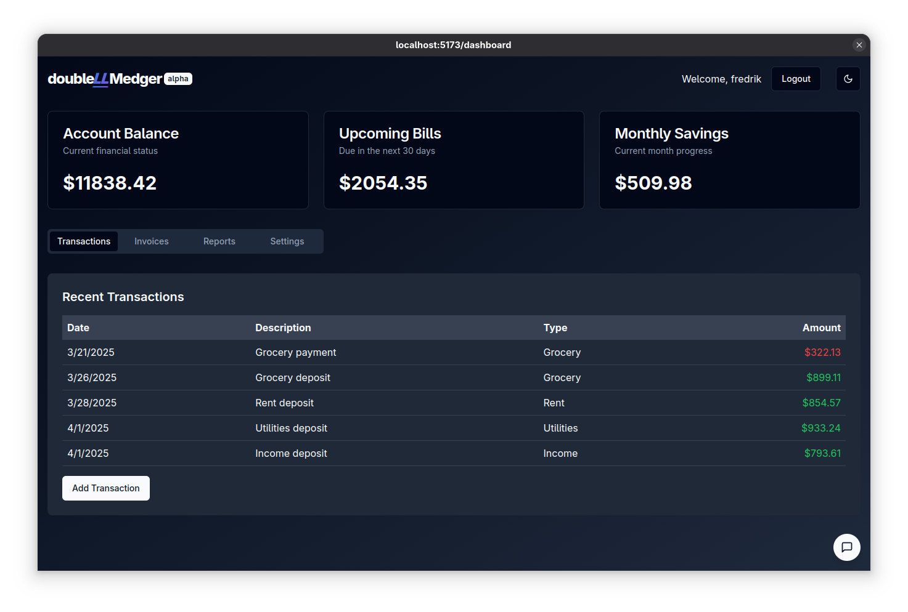

<div align="center">


**A dual-model financial ledger with tamper-resistant blockchain-inspired transaction verification**

</div>

<div align="center">

[](https://www.python.org/downloads/)
[](https://svelte.dev/)
[](LICENSE)

</div>

## 🚀 Overview

Double-LLMedger combines traditional double-entry accounting with LLM capabilities, creating an "LLM-first" financial ledger system. The name is a wordplay - it's a traditional double ledger accounting solution designed from the ground up to leverage LLM capabilities throughout the entire stack, making it easier to integrate AI-powered features for transaction verification, analysis, and reporting.

### 📊 Dashboard Preview
<div align="center">

</div>

## ✨ Key Features

- **Dual-Model Verification**: Uses two separate LLMs to independently verify transaction validity
- **Cryptographic Signing**: All transactions are cryptographically signed for authenticity
- **Tamper-Evident Records**: Any attempt to modify past transactions is immediately detectable
- **Modern UI**: Clean, responsive dashboard for financial monitoring and management
- **Secure Authentication**: Robust user authentication and authorization system
- **API-First Design**: Well-documented API for easy integration with other systems

## 🛠️ Tech Stack

### Backend
- **[FastAPI](https://fastapi.tiangolo.com/)**: High-performance API framework
- **[SQLAlchemy](https://www.sqlalchemy.org/)**: SQL toolkit and ORM
- **[Pydantic](https://docs.pydantic.dev/)**: Data validation and settings management
- **[Alembic](https://alembic.sqlalchemy.org/)**: Database migration tool

### Frontend
- **[Svelte](https://svelte.dev/)**: Component-based UI framework
- **[SvelteKit](https://kit.svelte.dev/)**: Full-stack Svelte framework
- **[Tailwind CSS](https://tailwindcss.com/)**: Utility-first CSS framework
- **[shadcn-svelte](https://next.shadcn-svelte.com/)**: Accessible UI components
- **[SuperForms](https://superforms.rocks/)**: Form handling and validation
- **[Zod](https://zod.dev/)**: TypeScript-first schema validation

## 📋 Getting Started

### Prerequisites

- Python 3.13+
- Node.js 18+
- npm or pnpm

### Installation

#### Backend

```bash
# Clone the repository
git clone https://github.com/username/double-lLMedger.git
cd double-lLMedger

# Create and activate virtual environment
python -m venv venv
source venv/bin/activate  # On Windows: venv\Scripts\activate

# Install dependencies
pip install -e .
# For development dependencies
pip install -e ".[dev]"

# Initialize database
python backend/init_db.py

# Start development server
python backend/main.py
```

#### Frontend

```bash
# Navigate to frontend directory
cd frontend

# Install dependencies
npm install
# or
pnpm install

# Start development server
npm run dev
# or
pnpm dev
```

## 🧪 Development

Our development process emphasizes code quality, consistent patterns, and modern practices:

- **Backend Commands**:
  - Lint: `ruff check`
  - Run: `python backend/main.py`

- **Frontend Commands**:
  - Dev: `npm run dev`
  - Build: `npm run build`
  - Lint: `npm run lint`
  - Format: `npm run format`
  - DB: `npm run db:push`, `npm run db:migrate`

For detailed development guidelines, see [CLAUDE.md](CLAUDE.md) and [CONVENTIONS.md](CONVENTIONS.md).

## 📁 Project Structure

```
double-lLMedger/
├── backend/                  # Python FastAPI backend
│   ├── api/                  # API endpoints
│   ├── core/                 # Core application components
│   ├── db/                   # Database models & setup
│   ├── schemas/              # Pydantic models
│   └── utils/                # Utility functions
│
├── frontend/                 # Svelte/SvelteKit frontend
│   ├── src/
│   │   ├── lib/              # Components and utilities
│   │   ├── routes/           # Page routes
│   │   └── app.html          # HTML template
│   └── static/               # Static assets
│
├── docs/                     # Documentation
│   ├── conventions/          # Coding standards
│   └── templates/            # Code templates
│
├── CLAUDE.md                 # Development commands
├── CONVENTIONS.md            # Code conventions
└── README.md                 # This file
```
## 🔒 Security Features

- Session-based authentication with secure HttpOnly cookies
- Password hashing with Argon2
- CSRF protection
- HTTP security headers
- Input validation
- Rate limiting

## 📚 Documentation

- API documentation is available at `/docs` when running the backend server
- Code conventions are documented in [CONVENTIONS.md](CONVENTIONS.md)
- Template code samples are available in the [docs/templates](docs/templates) directory

## 🤝 Contributing

Contributions are welcome! Please feel free to submit a Pull Request.

1. Fork the repository
2. Create your feature branch (`git checkout -b feature/amazing-feature`)
3. Commit your changes (`git commit -m 'Add some amazing feature'`)
4. Push to the branch (`git push origin feature/amazing-feature`)
5. Open a Pull Request

## 📄 License

This project is licensed under the MIT License - see the [LICENSE](LICENSE) file for details.